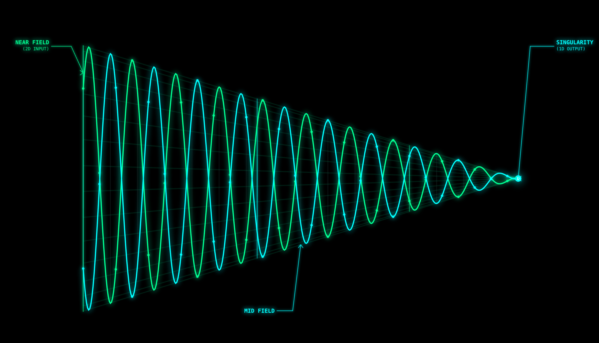
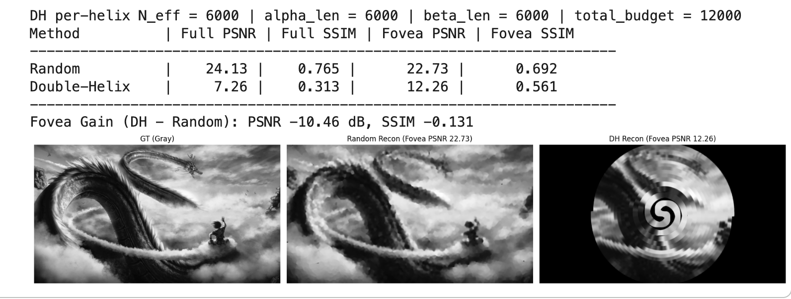
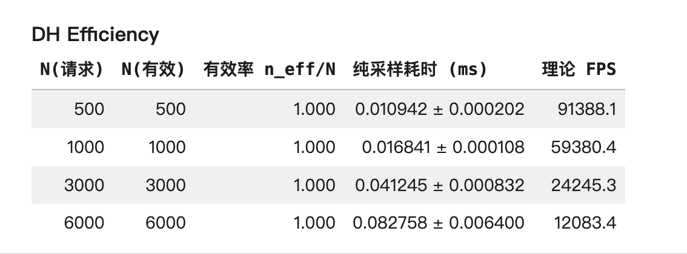

# Double-Helix Vision (DH)

> **A tiny, geometry-based visual sampler designed for extreme efficiency.**
[](https://colab.research.google.com/github/JackJ-C/double-helix-vision-tool/blob/main/DH.ipynb)

 ## 💡 The Concept

I built DH to solve a specific problem: **How can AI agents "see" effectively when bandwidth is extremely limited?**

Instead of processing a full 1080p image, DH mimics biological eyes. It uses a **Golden Spiral** to sample the image, focusing high density on the center (Fovea) and low density on the edges (Peripheral).


*(Figure: Compressing 2D space into a 1D signal using spiral geometry)*

## 📊 Experimental Results

We compared the classification accuracy of models trained on images sampled via Double-Helix vs. Random Sampling.
* **Metric:** Top-1 Accuracy on validation set (Average of 3 seeds)
* **Constraint:** Extremely low sampling budget (K points per helix)
### 1. Visual Trade-off: Focus vs. Coverage

*(Note: DH sacrifices background pixels to maintain high fidelity in the foveal region)*

### 2. Feature Capture Accuracy (The Data)
| K (per helix) | Total Points | DH Accuracy (Avg) | Random Accuracy (Avg) | **Gain** |
| :--- | :--- | :--- | :--- | :--- |
| **128** | ~256 | **26.65%** ± 1.30 | 20.62% ± 0.50 | **+6.03%** 🚀 |
| **256** | ~512 | **24.80%** ± 0.46 | 20.76% ± 0.40 | **+4.04%** |

> **Key Insight & Analysis:**
> * **Efficiency Sweet Spot:** With a highly constrained budget (K=128), DH achieves a **~29% relative improvement** over random sampling.
> * **Why K=256 drops:** At low resolutions (CIFAR-10, 32x32), higher density (K=256) introduces **foveal redundancy** (oversampling the same center pixels) without adding unique features. This confirms our hypothesis: **Geometric efficiency matters more than raw point count.**

<details>
<summary>👉 Click to view detailed training logs (Seeds 0-2)</summary>

```text
[Sampler] K(per-helix)=128, total=256
=== Final Comparison (K=128) ===
Seed 0: DH 27.58% vs Random 20.44%
Seed 1: DH 25.16% vs Random 21.19%
Seed 2: DH 27.20% vs Random 20.23%
----------------------------------
Avg   : DH 26.65% vs Random 20.62%

[Sampler] K(per-helix)=256, total=512
=== Final Comparison (K=256) ===
Seed 0: DH 24.47% vs Random 20.32%
Seed 1: DH 25.32% vs Random 20.85%
Seed 2: DH 24.61% vs Random 21.10%
----------------------------------
Avg   : DH 24.80% vs Random 20.76%
```
</details>

### 3. Extreme Efficiency

*(Benchmark: Throughput measured on NVIDIA T4 GPU)*

* **>90,000 FPS** at N=500.
* **Scalable:** Even at N=6000, it maintains >12,000 FPS.
* **Impact:** Ideal for **high-throughput cloud pipelines** and **low-latency real-time monitoring**.


## 🧠 Design Philosophy: Focus vs. Coverage

**Why did I define K=128 per helix (Total=256)?**

This parameter wasn't chosen for file size—it was chosen for **Robotic Focus**.

* **The Baseline Problem:** Random or Grid sampling attempts to "cover the screen" evenly. It assumes all pixels are equal.
* **The DH Solution:** In robotics, an agent needs to **"lock on"** to a target, not just view the scenery.
    * I set **K=128** as the minimal structural threshold for one helix to define a trajectory.
    * The two helices (Alpha & Beta) work together to create **Dynamic Foveation**—prioritizing the center (action) over the background (noise).

**In short:** We aren't trying to *compress* an image; we are simulating a biological eye searching for a target.
## 🛠️ Quick Start (Local)

If you prefer running this locally instead of Colab:

```bash
# 1. Clone the repo
git clone https://github.com/JackJ-C/double-helix-vision-tool.git
cd double-helix-vision-tool

# 2. Install dependencies
pip install -r requirements.txt

# 3. Run the script (optional)
# You can either run the notebook or a Python script
# jupyter notebook DH.ipynb
# or
# python DH-vision.py
```

## 📄 License

Distributed under the MIT License. See [LICENSE](LICENSE) for more information.
