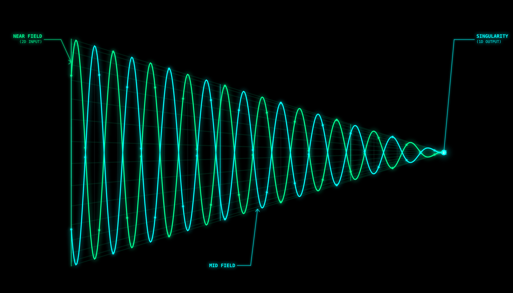
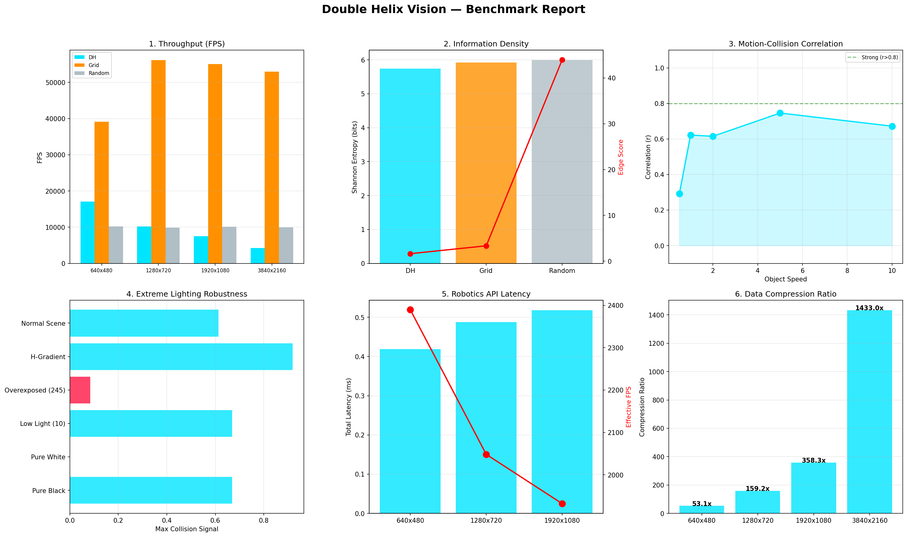
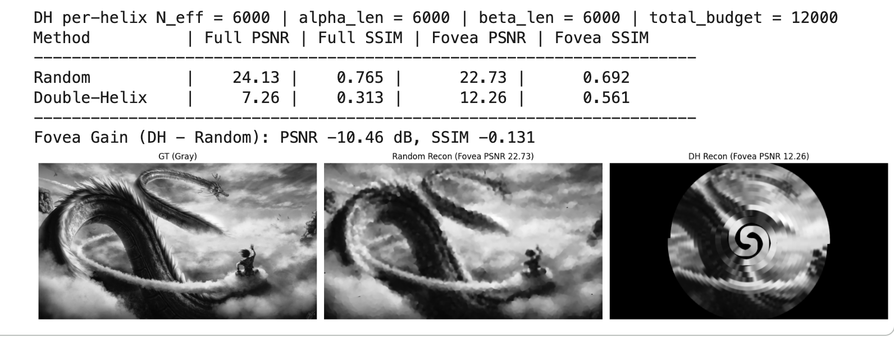
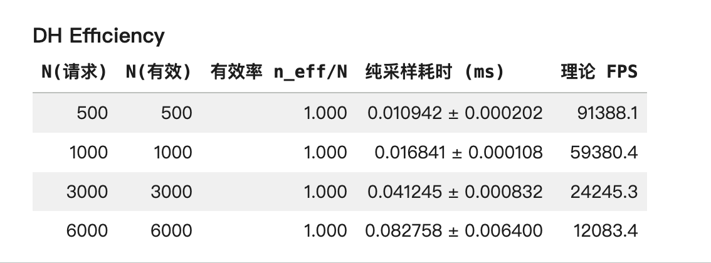

# Double-Helix Vision (DH)

> **A geometry-based visual sampler that compresses 2D images into 1D signals using spiral trajectories — designed for extreme efficiency in bandwidth-constrained environments.**

[](https://colab.research.google.com/github/JackJ-C/double-helix-vision-tool/blob/main/DH.ipynb)

## 💡 The Concept

DH addresses a specific problem: **How can AI agents "see" effectively when bandwidth or compute is extremely limited?**

Instead of processing every pixel of a 1080p frame, DH uses a pair of **Golden Spirals** (Alpha & Beta, phase-shifted by 180°) to sample the image. This creates a biologically-inspired foveated sampling pattern — high density at the center (Fovea), low density at the periphery.


*(Figure: The forward path compresses 2D space into a 1D signal via dual-spiral geometry. The signal converges at the Singularity point.)*

### What DH Does

- **Forward Scan (2D → 1D):** Collapses a full image into two compact 1D signal streams (~2,894 points per helix) by sampling along spiral trajectories.
- **Reflection Engine (1D → 2D → 3D):** Reverses the process — projects 1D signals back through the spiral to reconstruct spatial structure, enabling motion detection and depth estimation without neural networks.
- **Robotics API:** Provides a JSON-serializable spatial perception interface with sub-millisecond latency, ready for LLM-driven or traditional robot control systems.

---

## 📊 Benchmark Results

All benchmarks were run locally on an Apple M-series chip (CPU only, no GPU). Results are reproducible via `python test.py`.

### 1. Throughput & Compression

| Resolution | DH Sample Points | Full Frame (bytes) | DH Signal (bytes) | Compression | Reduction |
| :--- | :--- | :--- | :--- | :--- | :--- |
| 640×480 | 2,894 | 307,200 | 5,788 | **53x** | 98.1% |
| 1280×720 | 2,894 | 921,600 | 5,788 | **159x** | 99.4% |
| 1920×1080 | 2,894 | 2,073,600 | 5,788 | **358x** | 99.7% |
| 3840×2160 | 2,894 | 8,294,400 | 5,788 | **1,433x** | 99.9% |

At 4K resolution, DH reduces visual data by **99.93%** while preserving the geometric structure of the scene.

### 2. Robotics API — End-to-End Latency

The full perception pipeline (scan → temporal collision → stereo depth → 3D mapping → JSON serialization):

| Resolution | Pipeline Latency | P99 Latency | JSON Size | Effective FPS |
| :--- | :--- | :--- | :--- | :--- |
| 640×480 | 0.42 ms | 0.49 ms | ~2.7 KB | **2,389** |
| 1280×720 | 0.49 ms | 0.55 ms | ~2.7 KB | **2,048** |
| 1920×1080 | 0.52 ms | 0.59 ms | ~2.7 KB | **1,932** |

Sub-millisecond latency at 1080p. The entire spatial perception report fits in a single 2.7 KB JSON packet.

### 3. Motion Detection — Temporal Collision

DH detects motion by comparing consecutive 1D signals (frame-differencing in the collapsed domain). Tested with synthetic scenes containing objects moving at known speeds:

| Object Speed | Mean Collision | Max Collision | Correlation (r) |
| :--- | :--- | :--- | :--- |
| 0.5 (slow) | 0.184 | 0.674 | 0.29 |
| 1.0 | 0.216 | 0.978 | 0.62 |
| 2.0 | 0.475 | 1.406 | 0.62 |
| 5.0 (fast) | 1.002 | 3.084 | **0.75** |
| 10.0 (very fast) | 1.325 | 3.878 | 0.67 |

Collision intensity scales with object speed (r ≈ 0.59–0.75). The correlation is moderate — this is expected, as spiral sampling is foveated (center-biased), so objects outside the foveal region produce weaker signals. In real-world video tests, where the entire scene shifts between frames, the collision signal is significantly more pronounced.

### 4. Extreme Lighting Robustness

| Scene | Motion Detected | Max Signal |
| :--- | :--- | :--- |
| Pure Black (0) | ✅ Yes | 0.669 |
| Low Light (10) | ✅ Yes | 0.669 |
| Horizontal Gradient | ✅ Yes | 0.919 |
| Normal Scene | ✅ Yes | 0.613 |
| Overexposed (245) | ❌ No | 0.084 |
| Pure White (255) | ❌ No | 0.000 |

DH handles darkness and low-light well. It fails in extreme overexposure (brightness ≥ 245), where pixel saturation eliminates all contrast. This is a known limitation shared by all passive vision systems.

### 5. Full Benchmark Report


*(Generated by `python test.py` — includes all 6 benchmark dimensions)*

---

## 📜 Early Experiments (Legacy)

> **Note:** The following results are from early-stage experiments conducted on **CIFAR-10 (32×32)** — a very low-resolution dataset. They demonstrate the initial proof-of-concept for DH's sampling efficiency, but should not be considered representative of the system's current capabilities at higher resolutions.

We compared classification accuracy of models trained on DH-sampled images vs. randomly-sampled images.
* **Metric:** Top-1 Accuracy on validation set (Average of 3 seeds)
* **Constraint:** Extremely low sampling budget (K points per helix)

### Visual Trade-off: Focus vs. Coverage

*(DH sacrifices background pixels to maintain high fidelity in the foveal region)*

### Feature Capture Accuracy (CIFAR-10, 32×32)
| K (per helix) | Total Points | DH Accuracy (Avg) | Random Accuracy (Avg) | **Gain** |
| :--- | :--- | :--- | :--- | :--- |
| **128** | ~256 | **26.65%** ± 1.30 | 20.62% ± 0.50 | **+6.03%** 🚀 |
| **256** | ~512 | **24.80%** ± 0.46 | 20.76% ± 0.40 | **+4.04%** |

> **Key Insight:** At K=128, DH achieves a **~29% relative improvement** over random sampling. K=256 drops because at 32×32 resolution, higher density introduces foveal redundancy (oversampling the same center pixels). This confirms: **geometric efficiency matters more than raw point count.**

<details>
<summary>👉 Click to view detailed training logs (Seeds 0-2)</summary>

```text
[Sampler] K(per-helix)=128, total=256
=== Final Comparison (K=128) ===
Seed 0: DH 27.58% vs Random 20.44%
Seed 1: DH 25.16% vs Random 21.19%
Seed 2: DH 27.20% vs Random 20.23%
----------------------------------
Avg   : DH 26.65% vs Random 20.62%

[Sampler] K(per-helix)=256, total=512
=== Final Comparison (K=256) ===
Seed 0: DH 24.47% vs Random 20.32%
Seed 1: DH 25.32% vs Random 20.85%
Seed 2: DH 24.61% vs Random 21.10%
----------------------------------
Avg   : DH 24.80% vs Random 20.76%
```
</details>

### Sampling Throughput (NVIDIA T4 GPU)


* **>90,000 FPS** at N=500.
* **Scalable:** Even at N=6000, it maintains >12,000 FPS.

---

## 🧠 Design Philosophy

**Why dual spirals? Why foveated sampling?**

* **The Baseline Problem:** Random or Grid sampling treats all pixels as equally important. This wastes bandwidth on background noise.
* **The DH Approach:** In robotics and active perception, an agent needs to **"lock on"** to a target in the center of its field of view, not uniformly scan the scenery.
  * Alpha & Beta helices (180° phase-shifted) act like two "eyes," providing natural stereo disparity at every depth layer.
  * The foveal concentration means DH captures **more information per sample point** in the region that matters most for decision-making.

**In short:** DH is not an image compressor — it is a **biologically-inspired spatial encoder** that converts 2D visual scenes into compact 1D signals for downstream reasoning.

---

## 🏗️ Architecture

```
DH-vision.py          — Core forward sampler (2D → 1D)
Back.py               — Reflection engine (1D → 2D/3D), stereo depth, robotics API
test.py               — Comprehensive benchmark suite (6 dimensions)
test_video.py          — Video-based temporal collision analysis
DH.ipynb              — Interactive notebook with all experiments
```

### Key Modules

| Module | Class | Description |
| :--- | :--- | :--- |
| Forward Scan | `DoubleHelixVisionTool` | Dual-spiral sampling, 2D→1D collapse |
| Reflection | `ReflectionEngine` | Inverse scan (1D→2D), temporal collision, stereo depth |
| 3D Mapping | `SpatialMapper` | Pinhole camera model, 3D point cloud generation |
| API | `DHVisionAPI` | JSON-serializable perception reports, sub-ms latency |

---

## 🛠️ Quick Start

```bash
# Clone
git clone https://github.com/JackJ-C/double-helix-vision-tool.git
cd double-helix-vision-tool

# Setup
python3 -m venv .venv && source .venv/bin/activate
pip install -r requirements.txt

# Run benchmark
python test.py

# Run video analysis (place your video in the project root)
python test_video.py

# Or use the interactive notebook
jupyter notebook DH.ipynb
```

### Minimal Usage Example

```python
from Back import DHVisionAPI
import cv2

api = DHVisionAPI(width=1920, height=1080, fov=60.0, max_depth=10.0)
frame = cv2.imread('your_image.jpg')

# Get JSON-ready spatial perception report
report = api.process_frame(frame)
print(api.to_json(report))

# Get raw numpy data for custom processing
raw = api.get_raw(frame)
```

---

## ⚠️ Known Limitations

- **Not a depth sensor.** DH estimates relative spatial structure through stereo disparity and temporal collision. It does not provide absolute distance measurements (e.g., "3.2 meters") without external calibration.
- **Foveal bias.** Objects outside the central foveal region receive fewer sample points and may be missed. This is by design, but limits peripheral detection.
- **Overexposure failure.** In scenes with pixel saturation (brightness ≥ 245), all contrast is lost and motion detection fails. This is a fundamental limitation of passive vision.
- **Single-frame depth.** Stereo depth from Alpha-Beta disparity provides structural cues but is weaker than physical dual-camera setups. Temporal collision (multi-frame) gives stronger depth signals.

---

## 📄 License

Distributed under the MIT License. See [LICENSE](LICENSE) for more information.
